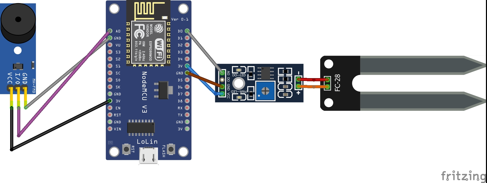

# Projeto IoT - Monitoramento de Umidade (ODS 6)

Este projeto visa monitorar a umidade utilizando o sensor YL-69 e acionar um buzzer quando a umidade estiver abaixo do ideal. Os dados são enviados via protocolo MQTT usando um ESP8266 (NodeMCU).

## 🚀 Componentes Utilizados
## Hardware Utilizado
- **NodeMCU ESP8266**: Microcontrolador utilizado para o processamento e comunicação via MQTT.
- **Sensor de umidade YL-69**: Sensor para monitoramento da umidade do solo.
- **Módulo Buzzer**: Atuador que emite som quando a umidade está alta.
- **Jumpers**: Componente para conexão entre as peças do projeto (ESP8266, Buzzer e Sensor de Umidade)
- **Cabo USB 5V**: Conexão para ligar e parelhar o microcontrolador e manipular o código no Arduino IDE.

## 🌐 Comunicação
O projeto usa o protocolo MQTT para enviar os dados do sensor e acionar o atuador. Utiliza o broker mqtt-dashboard.com para teste.

## 🛠️ Esquema de Montagem

## 📂 Como usar
1. Suba o código no ESP8266 via Arduino IDE.
2. Configure sua rede Wi-Fi no código.
3. Monitore os dados via MQTT.
4. O buzzer será ativado se a umidade estiver acima de 30%.

## 📈 Resultados
- Tempo médio de resposta do sensor: X ms
- Tempo médio de acionamento do buzzer: Y ms
- Comunicação MQTT demonstrada no vídeo.

## 📹 Vídeo de Demonstração
Assista no YouTube: 

## 🧪 Testes
- Foram realizados 4 testes de tempo de resposta.
- Resultados disponíveis no artigo final.

## 🔗 Licença
Uso acadêmico - Projeto para disciplina de IoT.
